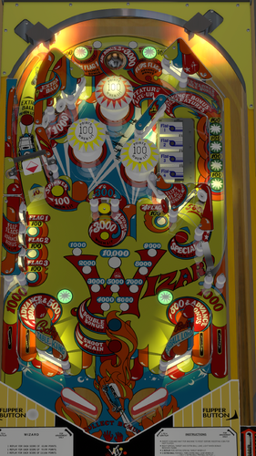

# Wizard! (Bally 1975) 

---

## Files
| File Type | Link | Version | Author |
|:---------:|:----:|:-------:|:------:|
| VPX | [VP Universe](https://vpuniverse.com/files/file/19351-wizard-bally-1975/) | 1.0.0 | [MauiPunter](https://vpuniverse.com/profile/60767-mauipunter/) |
| B2S | [VP Universe](https://vpuniverse.com/files/file/14660-wizard-bally-1975-b2s) | 1.0.0 | [hauntfreaks](https://vpuniverse.com/profile/5216-hauntfreaks/) |
| DMD | N/A | N/A | N/A |
| ROM | N/A | N/A | N/A |

**Tested by:** [Imscomobob]

---

## Status 
Minimum VPX Standalone build: 10.8.0-1983-a764013
| Playfield | Controls | Backglass | DMD | ROM Required | FPS | 
|-----------|----------|-----------|-----|--------------|-----|
| :white_check_mark: | :white_check_mark: | :white_check_mark: | :white_check_mark: | :x: | 60 |

---

## Instructions
- Copy the contents of this repo folder to your USB drive
- Add your personalized launcher.elf and rename it to vpx-wizard.elf
- Download the table and directb2s versions listed above and copy them into this folder.
- Wizard!
