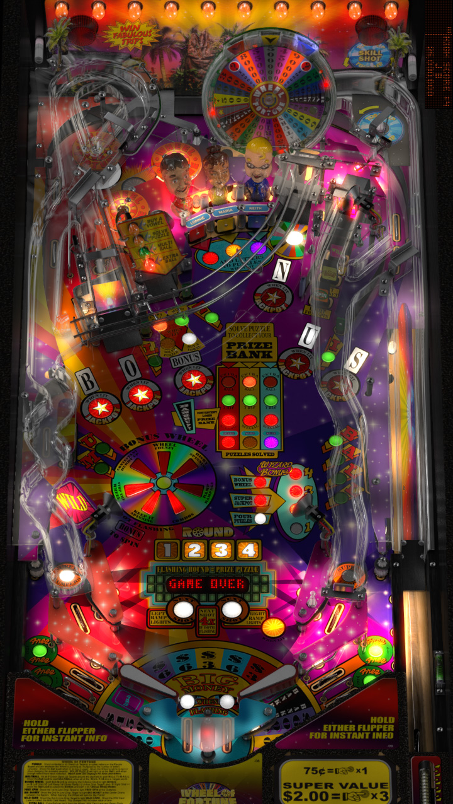

# Wheel of Fortune (Stern 2007)

---

## Files
| File Type | Link | Version | Author |
|:---------:|:----:|:-------:|:------:|
| VPX | [VP Universe](https://vpuniverse.com/files/file/5501-wheel-of-fortune-stern-2007/) | 1.0 | [ninuzzu](https://vpuniverse.com/profile/5530-ninuzzu/) |
| B2S | [VP Universe](https://vpuniverse.com/files/file/2434-wheel-of-fortune-stern-2007/) | 1.1.0 | [Wildman](https://vpuniverse.com/profile/5-wildman/) |
| DMD | N/A | N/A | N/A |
| ROM | [VP Universe](https://vpuniverse.com/files/file/3291-wheel-of-fortune-v50/) | N/A | N/A |

**Tested by:** [Imscomobob]

---

## Status 
**Minimum VPX Standalone build:** 10.8.0-1983-a764013
| Playfield | Controls | Backglass | DMD | ROM Required | FPS | 
|-----------|----------|-----------|-----|--------------|-----|
| :white_check_mark: | :white_check_mark: | :white_check_mark: | :white_check_mark: | :white_check_mark: | 37 |

---

## Instructions
- Would you like to buy a vowel?
