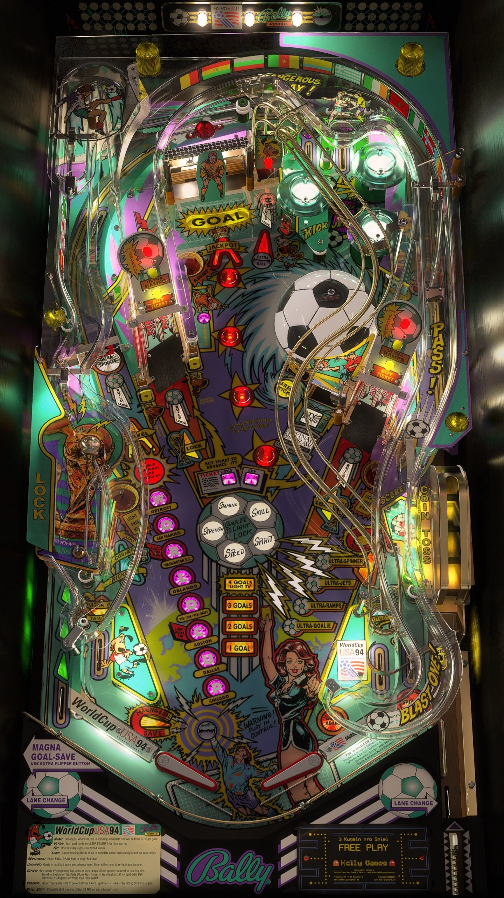

# World Cup Soccer (Bally 1994)

---

## Files
| File Type | Link | Version | Author |
|:---------:|:----:|:-------:|:------:|
| VPX | [VP Universe](https://vpuniverse.com/files/file/10534-world-cup-soccer-bally-1994/) | 1.4 | [VPUStaff](https://vpuniverse.com/profile/50-vpustaff/content/?type=downloads_file) |
| B2S | [VP Universe](https://vpuniverse.com/files/file/4873-world-cup-soccer-bally-midway-1994/) | 1.0.0 - 2&3_scr_big_DMD.directb2s| [Blacksad](https://vpuniverse.com/profile/9127-blacksad/content/?type=downloads_file) |
| DMD | N/A | N/A | N/A |
| ROM | [VP Forums](https://www.vpforums.org/index.php?app=downloads&showfile=296) | wcs_l2.zip | [destruk](https://www.vpforums.org/index.php?showuser=5) |

**Tested by:** [psybocilin]

 

## ⚠️ Warning

There is a known bug on this table, if you soft plunge there is a chance the ball could 
get stuck in the coin flip rail. It is recommended to always full plunge.

 

## Status 
Minimum VPX Standalone build: 10.8.0-1989-a764013
| Playfield | Controls | Backglass | DMD | ROM Required | FPS | 
|-----------|----------|-----------|-----|--------------|-----|
| :white_check_mark: | :white_check_mark: | :white_check_mark: | :white_check_mark: | :white_check_mark: | 32 |

---

## Instructions
- Copy the contents of this repo folder to your USB drive
- Add your personalized launcher.elf and rename it to `vpx-worldcupsoccer.elf`
- Download the table and directb2s versions listed above, extract (if necessary) and copy them into `vpx-worldcupsoccer` folder
- Place ROM zip file into `vpx-worldcupsoccer/pinmame/roms` folder. DO NOT UNZIP!
- Make sure `(.vpx)` `(.direct2b2s)` and `(.ini)` are all named the same.

## Note 
- Table file is listed as version 1.4 on download page but the vpx file in the downloaded .rar is version 1.5.
