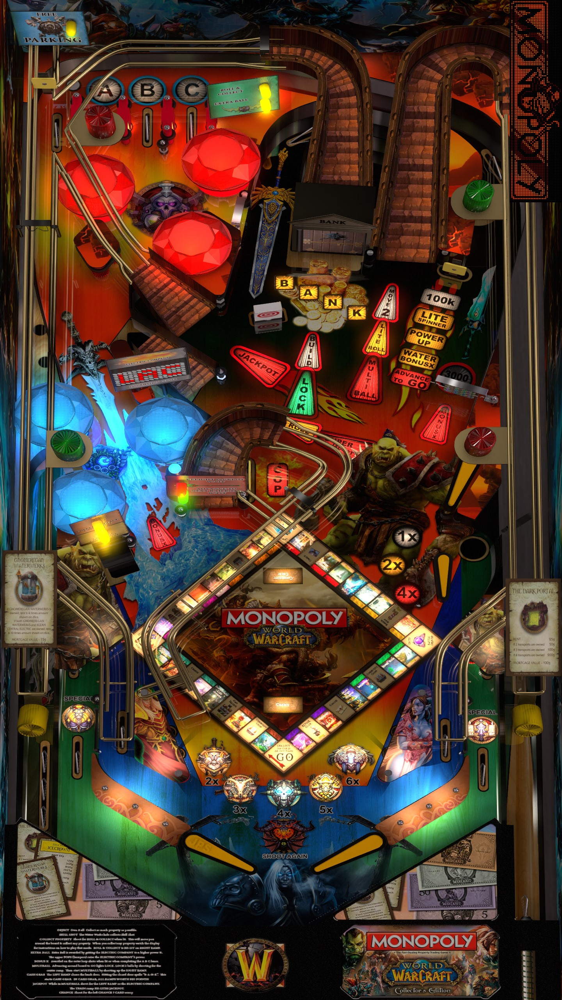

# WOW Monopoly, JPs (Original 2015)

---

## Files
| File Type | Link | Version | Author |
|:---------:|:----:|:-------:|:------:|
| VPX | [VP Forums](https://www.vpforums.org/index.php?app=downloads&showfile=11612) | 4.0.0 | [jpsalas](https://www.vpforums.org/index.php?showuser=277) |
| B2S | [VP Forums](https://www.vpforums.org/index.php?app=downloads&showfile=10808) | 1.0 | [hauntfreaks](https://www.vpforums.org/index.php?showuser=73849) |
| DMD | N/A | N/A | N/A |
| ROM | [VP Forums](https://www.vpforums.org/index.php?app=downloads&showfile=7320) | monopoly.zip | [destruk](https://www.vpforums.org/index.php?showuser=5) |

**Tested by:** [TechZombie]

---

## Status 
Minimum VPX Standalone build: 10.8.0-1983-b84441e
| Playfield | Controls | Backglass | DMD | ROM Required | FPS | 
|-----------|----------|-----------|-----|--------------|-----|
| :white_check_mark: | :white_check_mark: | :white_check_mark: | :white_check_mark: | :white_check_mark: | 60 |

---

## Instructions
- Copy the contents of this repo folder to your USB drive
- Add your personalized launcher.elf and rename it to vpx-wowmonopoly.elf
- Download the table and directb2s zips above, extract and copy into /external/vpx-wowmonopoly
- Download the rom (monopoly.zip) stays in zip folder, place zip file in vpx-wowmonopoly/pinmame/roms
- Make sure (.vpx), (.directb2s), (.vbs) and (.ini) files are all named the same
- Varok Saurfang - "You cannot kill hope."
