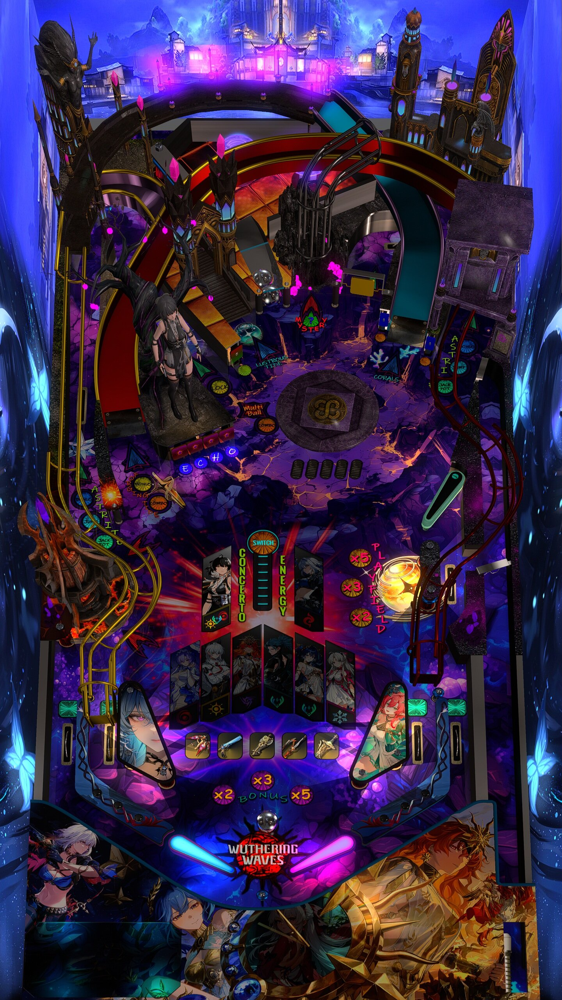

# Wuthering Waves (Original 2026)

---

## Files
| File Type | Link | Version | Author(s) | 
|-----------|--------|----------|--------------|
| **VPX** | [VPUniverse](https://vpuniverse.com/files/file/30792-wuthering-waves-table-pup/) | 1.0.0 | GtecArcade |
| **B2S** | Included in pupPack |
| **PUPPACK** | Download `WuWa.rar` from VPX link. |

**Tested by:** Curt

---

## Status 

| Backglass | DMD | ROM Required | Has Puppack | FPS |
|-----------|-----|-----|-----|-----|
| ❌ | ❌ | ❌ | ✅ | 57 |

---

## Instructions

- Install this table through the Table Manager, using the `Add Table` > `Manual` page
- Do NOT download the `.ini` file from the VPX link, use the one posted here.
- Click `GO TO TABLE` after adding, and the TM will open to the table folder. At that time:
  - Create a folder titled `pupvideos` in the 4KP table folder
  - unzip the PuP File on your computer 
  - In the folder `WuWa/PuP-Pack_Options/(2 Screens) Pup on Backglass, Default Locale Topper off`, copy the files `playlists.pup`, `screens.pup`, and `triggers.pup`
  - Paste these files into the top-level `WuWa` folder, replacing the copies that are there.
  - Upload the `WuWa` folder on your computer to the `pupvideos` folder on your 4KP
  - When you are ready to play, be sure you know how your MagnaSave buttons are mapped--they will be needed to make initial character selection.
- If you need help, more information can be found on the wiki: [TM - Add Table - Manual](https://github.com/LegendsUnchained/vpx-standalone-alp4k/wiki/%5B04%5D-%F0%9F%A7%A1-TM-%E2%80%90-Other-Features#add-table---manual)

- 'Master the concerto. Summon your echos. [sic]'
