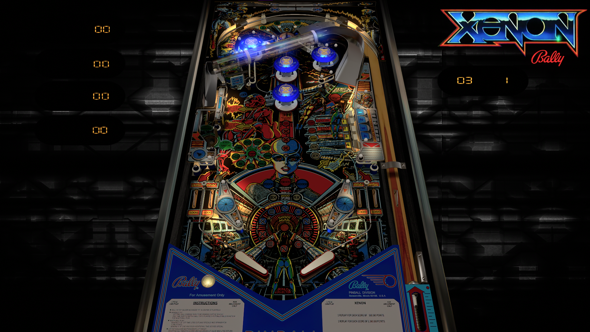

# Xenon (Bally 1980)

---

## Files
| File Type | Link | Version | Author |
|:---------:|:----:|:-------:|:------:|
| VPX | [VPUniverse](https://vpuniverse.com/files/file/6313-xenon-bally-1980/) | 2.5.2 | [hauntfreaks](https://vpuniverse.com/profile/5216-hauntfreaks/) |
| B2S | [VP Universe](https://vpuniverse.com/files/file/4929-xenon-bally-1980-directb2s-2048px/) | 1.0.0 | [blacksad](https://vpuniverse.com/profile/9127-blacksad/) |
| DMD | Included with B2S | N/A | N/A |
| ROM | [vpforums](https://www.vpforums.org/index.php?app=downloads&showfile=671) | xenon.zip | N/A |

**Tested by:** [kaoticBPR]

---

## Status 
Minimum VPX Standalone build: 10.8.0-1989-a764013
| Playfield | Controls | Backglass | DMD | ROM Required | FPS | 
|-----------|----------|-----------|-----|--------------|-----|
| :white_check_mark: | :white_check_mark: | :white_check_mark: | :white_check_mark: | :white_check_mark: | 40 |

---

## Instructions
- Copy the contents of this repo folder to your USB drive
- Add your personalized launcher.elf and rename it to `vpx-xenon.elf`
- Download the table and directb2s versions listed above, extract (if necessary) and copy them into `vpx-xenon`
- Rom file (`xenon.zip`) stays in zip folder, place zip file in `vpx-xenon/pinmame/roms`
- Make sure `(.vpx)` `(.direct2b2s)` `(.vbs)` and `(.ini)` are all named the same.
