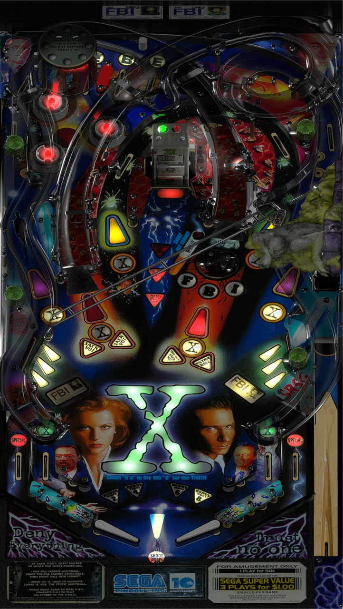

# X Files (Sega 1997)

---

## Files
| File Type | Link | Version | Author |
|:---------:|:----:|:-------:|:------:|
| VPX | [VP Universe](https://vpuniverse.com/files/file/14912-the-x-files-sega-1997/) | 1.2.9 | [TastyWasps](https://vpuniverse.com/profile/44724-tastywasps/) |
| B2S | [VP Universe](https://vpuniverse.com/files/file/14927-x-files-sega-1997-b2s-with-full-dmd/) | 1.0.0 | [Hauntfreaks](https://vpuniverse.com/profile/5216-hauntfreaks/) |
| DMD | Included with B2S | N/A | N/A |
| ROM | [VP Forums](https://www.vpforums.org/index.php?app=downloads&showfile=1077) | xfiles.zip | N/A |

**Tested by:** [Bla1ze]

---

## Status
**Minimum VPX Standalone build:** 10.8.0-1989-a764013
| Playfield | Controls | Backglass | DMD | ROM Required | FPS | 
|-----------|----------|-----------|-----|--------------|-----|
| :white_check_mark: | :white_check_mark: | :white_check_mark: | :white_check_mark: | :white_check_mark: | 40 |

---

## Instructions
- Copy the contents of this repo folder to your USB drive
- Add your personalized launcher.elf and rename it to `vpx-xfiles.elf`
- Download the table and directb2s versions listed above, extract (if necessary) and copy them into `vpx-xfiles`
- Rom file (`xfiles.zip`) stays in zip folder, place zip file in `vpx-xfiles/pinmame/roms`
- Make sure `(.vpx)` `(.direct2b2s)` `(.vbs)` and `(.ini)` are all named the same.
- "Trust no-one!"
