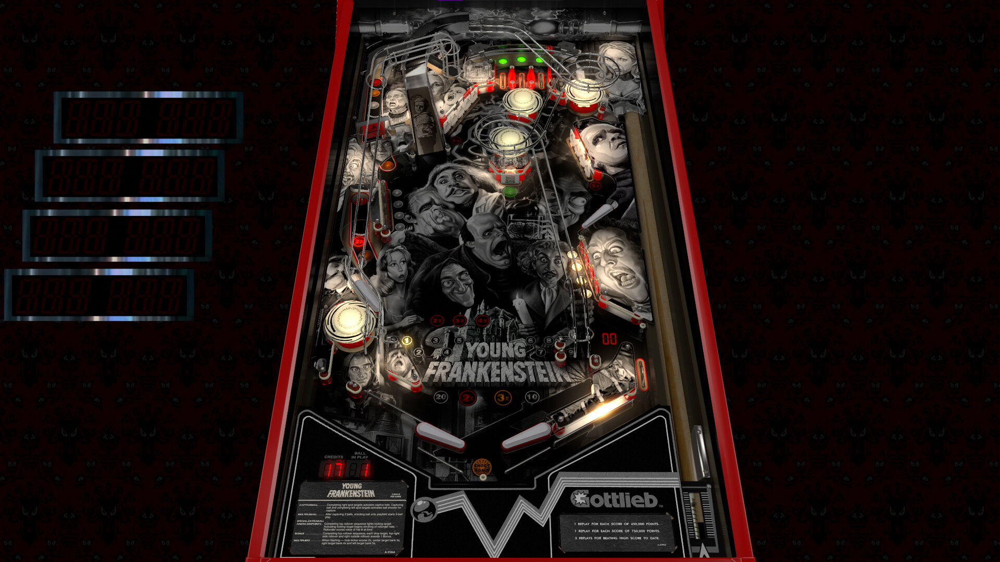

# Young Frankenstein (hauntfreaks 2021)

---

## Information
| File Type | Link | Version | Author | 
|:---------:|:----:|:-------:|:------:|
| VPX | [VP Universe](https://vpuniverse.com/files/file/7656-young-frankenstein-hauntfreaks-2021-107-only/) | 1.0.0 | [hauntfreaks](https://vpuniverse.com/profile/5216-hauntfreaks/) |
| B2S | [VP Universe](https://vpuniverse.com/forums/files/file/7653-young-frankenstein-hauntfreaks-2021-2-and-3-screen-b2s/) | Young Frankenstein (hauntfreaks 2021).directb2s | [hauntfreaks](https://vpuniverse.com/profile/5216-hauntfreaks/) |
| DMD | N/A | N/A | N/A |
| ROM | [VP Universe](https://vpuniverse.com/files/file/1089-eclipsezip/?do=download) | eclipse.zip | [VPUStaff](https://vpuniverse.com/profile/50-vpustaff/) |

**Tested by:** [Mox]

---

## Status 
Minimum VPX Standalone build: 10.8.0-2006-6d603fb
| Playfield | Controls | Backglass | DMD | ROM Required | FPS | 
|:---------:|:--------:|:---------:|:---:|:------------:|:---:|
| :white_check_mark: | :white_check_mark: | :white_check_mark: | :white_check_mark: | :white_check_mark: | 43 |

---

## Instructions
- Copy the **vpx-youngfrankenstein** folder to the `external` directory of your USB drive
- Add your personalized launcher.elf and rename it to **vpx-youngfrankenstein.elf**
- Download and extract the **VPX** file ONLY, and copy into the **vpx-youngfrankenstein** folder
- Download and extract `Young Frankenstein (hauntfreaks 2021).directb2s`, and copy into the **vpx-youngfrankenstein** folder
- Make sure (`.vpx`), (`.directb2s`), (`.vbs`), and (`.ini`) files are all named the same
- Download the **ROM** version listed above and copy it into `\vpx-youngfrankenstein\pinmame\roms` (DO NOT UNZIP)
- "Put. The. Candle. Back."