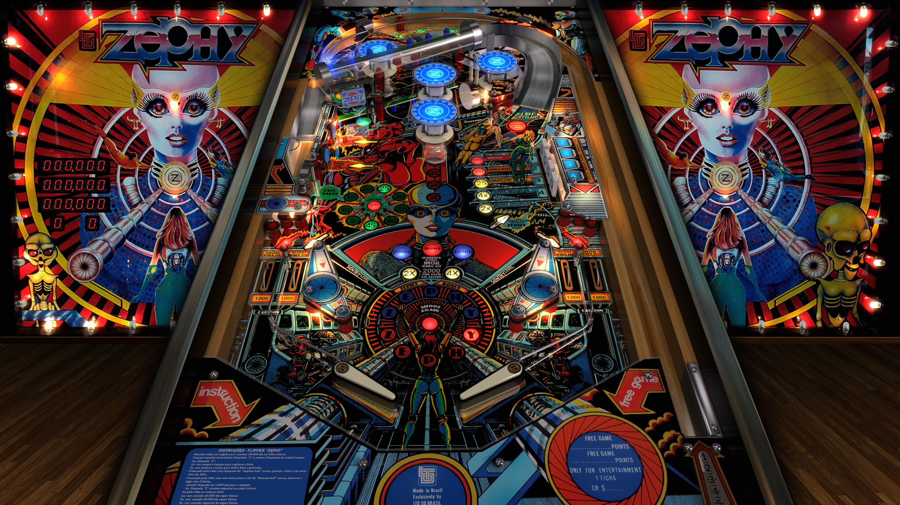

# Zephy (LTD do Brasil 1982) [== Xenon (Bally, 1980) == Zarza (Taito, 1980) ]

---

## Files
| File Type | Link | Version | Author |
|:---------:|:----:|:-------:|:------:|
| VPX | [VPForums](https://www.vpforums.org/index.php?app=downloads&showfile=14993) | 5.5.0 | [jpsalas](https://www.vpforums.org/index.php?showuser=277}) |
| B2S | Included in VPX link | N/A | N/A |
| DMD | Included in VPX link | N/A | N/A |
| ROM | [VPForums](https://www.vpforums.org/index.php?app=downloads&showfile=474) | N/A | [destruk](https://www.vpforums.org/index.php?showuser=5}) |

**Tested by:** [Curt]

---

## Status 
**Minimum VPX Standalone build:** 10.8.0-1989-a764013
| Playfield | Controls | Backglass | DMD | ROM Required | FPS | 
|-----------|----------|-----------|-----|--------------|-----|
| :white_check_mark: | :white_check_mark: | :white_check_mark: | :x: | :white_check_mark: | 50 |

---

## Instructions
