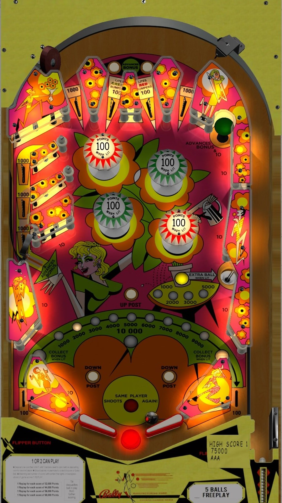

# Zip-A-Doo (Bally 1970)

---

## Files
| File Type | Link | Version | Author |
|:---------:|:----:|:-------:|:------:|
| VPX | [VPUniverse](https://vpuniverse.com/files/file/15256-zip-a-doo-bally-1970_teisen_mod/) | Zip-A-Doo (Bally 1970)_Teisen_MOD | [teisen](https://vpuniverse.com/profile/31525-teisen/) & [loserman76](https://vpuniverse.com/profile/2798-loserman76/) & [loserman76](https://vpuniverse.com/profile/2798-loserman76/) |
| B2S | [VPUniverse](https://vpuniverse.com/files/file/15256-zip-a-doo-bally-1970_teisen_mod/) | Zip-A-Doo (Bally 1970) | [HauntFreaks](https://vpuniverse.com/profile/5216-hauntfreaks/) |
| DMD | N/A | N/A | N/A |
| ROM | N/A | N/A | N/A |

**Tested by:** [evilwraith]

---

## Status 
**Minimum VPX Standalone build:** 10.8.0-1989-a764013
| Playfield | Controls | Backglass | DMD | ROM Required | FPS | 
|-----------|----------|-----------|-----|--------------|-----|
| :white_check_mark: | :white_check_mark: | :white_check_mark: | :x: | :x: | 50 |

---

## Instructions
- Copy the contents of this repo folder to your USB drive
- Add your personalized launcher.elf and rename it to `vpx-zipadoo.elf`
- Download the table and directb2s versions listed above, extract (if necessary) and copy them into `vpx-zipadoo`
- Make sure `(.vpx)` `(.direct2b2s)` `(.vbs)` and `(.ini)` are all named the same.
