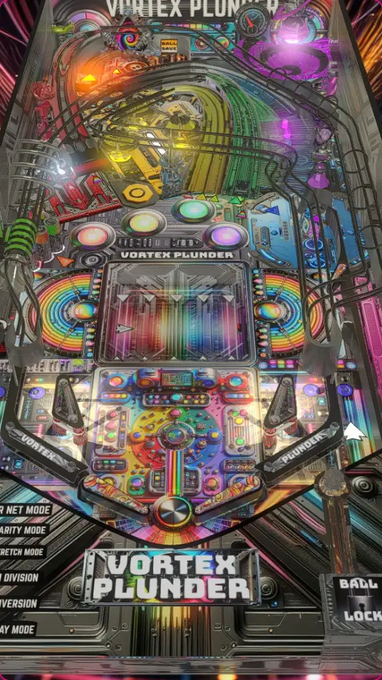

# Vortex Plunder (Original 2025)

  

---

## Files
| File Type | Link | Version | Author | 
|-----------|--------|----------|--------------|
| **VPX** | [VP Forums](https://www.vpforums.org/index.php?app=downloads&showfile=18898) | 1.0 | [CrimsonTurtle8](https://www.vpforums.org/index.php?showuser=49512) |
| **B2S** | [VP Forums](https://www.vpforums.org/index.php?app=downloads&showfile=18898) | 1.0 | [CrimsonTurtle8](https://www.vpforums.org/index.php?showuser=49512) |

**Tested by:** [BrianCK]

---

## Status 
**Minimum VPX Standalone build:** {vpx-standalone-build-#}
| Playfield | Controls | Backglass | DMD | ROM Required | FPS | 
|-----------|----------|-----------|-----|--------------|-----|
| :white_check_mark: | :white_check_mark: | :white_check_mark: | :white_check_mark: | :x: | 60 |

---

## Instructions
- Download Files Named:  'Vortex Plunder Wheel, B2S, POV.zip' and 'Vortex Plunder.part1.rar'
- Copy the contents of this repo folder to your USB drive
- Add your personalized launcher.elf and rename it to `vpx-vortexplunder.elf`
- Download the table and directb2s versions listed above, extract (if necessary) and copy them into `vpx-vortexplunder`
- Make sure `(.vpx)` `(.direct2b2s)`` and `(.ini)` are all named the same.
